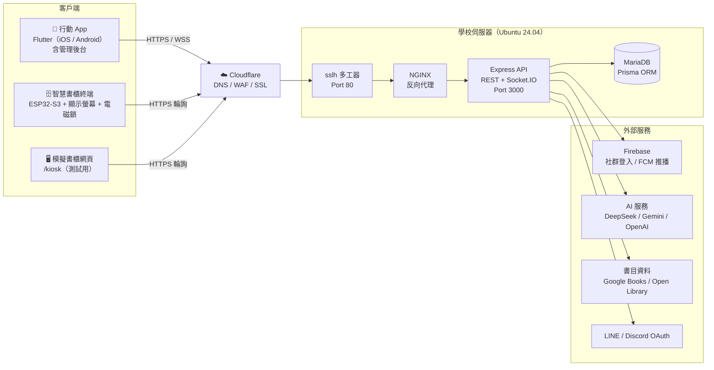

# 救『舊』我的書 - 智慧二手書交易系統 

## 📝 專案介紹
「救『舊』我的書」是一套整合**行動應用程式**與**智慧書櫃**的校園二手書交易平台。學生之間的二手書交易常遇到幾個問題：面交時間難以配合、書況描述與實物有落差、預付款後可能遭遇詐騙。本系統以「校園循環經濟」為出發點，用「先驗收、後撥款」的機制處理交易信任問題，並簡化上架流程。

**核心特色**
* 📷 **ISBN 掃描快速上架**：掃描條碼自動帶入書名、作者、出版社等書目資料，賣家只需補上書況照片與價格；AI 協助填寫書況描述，並預先審核上架內容。
* 🗄️ **智慧書櫃實體交付**：自製木作書櫃（正面面板與櫃門為壓克力雷射切割）搭配 ESP32-S3 控制電磁鎖，賣家掃 QR Code 存書，買家隨時自行取書，提供 24 小時非同步交付。
* 🛡️ **先驗收、後撥款**：買家取書並確認書況後，系統才將款項撥給賣家；書況不符時可提出申訴、暫停交易，由管理員介入處理。
* 💬 **即時互動**：買賣雙方即時聊天、訂單推播通知，另有 AI 客服回答平台使用問題。
* 🏅 **會員經營**：會員等級、成就徽章與錢包制度，提升使用者參與感。
* 🔐 **多元登入**：帳號密碼、Google、Apple、LINE、Discord、手機簡訊、通行密鑰（Passkey）與生物辨識。
* 🧑‍💼 **後台管理**：會員、書籍、訂單、申訴、書櫃裝置、公告、AI 設定與資料備份皆可在後台管理。

## 🏗️ 系統架構
系統分為三層：**客戶端**（Flutter App、智慧書櫃終端）、**雲端代理層**（Cloudflare）與**學校伺服器**（NGINX + Express API + MariaDB），並串接 Firebase、AI 服務與書目資料等外部服務。



> 完整部署圖請見 [`Diagrams/System Architecture/v3/deployment.png`](Diagrams/System%20Architecture/v3/deployment.png)。

| 層級 | 技術 | 說明 |
| --- | --- | --- |
| 行動端 | Flutter（Dart） | iOS 15.5+ / Android 8.0+，買賣家功能與管理後台共用同一份程式碼，支援繁中、簡中、英、日、韓 |
| 後端 API | Node.js、Express 5、Socket.IO | 依 `routes/` → `services/` 分層；REST API 搭配 Socket.IO 即時推送聊天與書櫃狀態，API 文件以 OpenAPI + Scalar 提供（`/api-docs`） |
| 資料庫 | MariaDB / MySQL、Prisma 7 | 資料表定義於 `prisma/schema.prisma` |
| 智慧書櫃 | ESP32-S3（C++、ESP-IDF、PlatformIO） | 透過 2.4GHz Wi-Fi 以 HTTPS 輪詢後端，控制四組電磁鎖與 2.8 吋橫向螢幕；`/kiosk` 網頁可模擬書櫃進行測試 |
| 伺服器與網路 | Ubuntu 24.04、NGINX、sslh、Cloudflare | Cloudflare 負責 DNS 解析、WAF 與 SSL，NGINX 將 `/api`、`/socket.io`、`/kiosk` 轉發至 API |
| 外部服務 | Firebase、DeepSeek / Gemini / OpenAI、Google Books / Open Library | 社群登入與推播、AI 上架輔助與客服、ISBN 書目查詢 |
| 硬體設計 | SolidWorks 2025 | 書櫃建模與壓克力雷射切割圖檔 |
| 設計與協作 | Figma、Git / GitHub | UI/UX 設計、版本控管與團隊協作 |

## 👥 團隊成員
* **指導老師：** 林俊杰老師 
* **專題成員：** 許凱俊、江芸萱、連卉媗、陳秉鴻 

## 🗄️ 專案檔案樹
```text
SaveMyBook/
├── .github/workflows/            # GitHub Actions（每日更新 README 開發數據統計）
├── branding/                     # 品牌視覺
│   ├── Logo Design/              # 各版本 Logo、去背圖
│   └── Badges Design/            # 識別證設計（印刷檔、圖檔、編輯檔）
├── competition/                  # 各項專題競賽簡章、報名表與上傳資料
├── database/                     # 早期資料庫建置腳本、SQL 備份與測試資料
├── Diagrams/                     # 系統分析與設計圖表
│   ├── Activity diagram/         # 活動圖
│   ├── Analysis Class Diagram/   # 分析類別圖
│   ├── Circuit diagram/          # 智慧書櫃電路圖與接線圖
│   ├── Class diagram/            # 設計類別圖
│   ├── Component diagram/        # 元件圖
│   ├── Functional Map/           # 功能地圖（App / Web）
│   ├── Gantt chart/              # 專案甘特圖
│   ├── Package Diagram/          # 套件圖
│   ├── Relational Tables/        # 資料庫關聯表
│   ├── Sequence Diagrams/        # 循序圖
│   ├── State Machine/            # 狀態機圖（商品、訂單）
│   ├── System Architecture/      # 系統架構圖與部署圖
│   ├── UI Flow/                  # 介面流程圖
│   ├── Use Case/                 # 使用案例圖
│   └── tools/                    # 圖表產生與檢查腳本
├── documents/                    # 專案文件
│   ├── 系統手冊/                 # 系統手冊（初評版、複評版）
│   ├── 系統簡介/                 # 系統簡介
│   ├── 部署/                     # 各次部署清單與更新說明
│   └── 個資法/                   # 個資法相關資料
├── hardware_design/              # 智慧書櫃 3D 建模與切片檔（v1 ~ v7）
├── market_research/              # 前期市場調查
│   ├── competitor_analysis/      # 競品分析表
│   └── surveys/                  # 需求問卷調查與統計結果
├── meeting_minutes/              # 歷次會議紀錄（PDF）
├── presentation/                 # 評審簡報、評審攻防與介紹動畫
├── ui_ux_design/                 # 前端介面設計稿
│   ├── design/                   # 精稿設計
│   └── wireframe/                # 介面線框圖
├── savemybook_api/               # 後端 API（Node.js / Express）
│   ├── config/                   # 環境變數與 OpenAPI 設定
│   ├── constants/                # 業務常數與政策設定
│   ├── docs/                     # OpenAPI 文件（YAML）
│   ├── jobs/                     # 排程工作
│   ├── lib/                      # 共用函式（驗證、ISBN、推播、AI 等）
│   ├── middleware/               # 驗證、權限、限流、安全標頭
│   ├── prisma/                   # 資料庫 Schema 與種子資料
│   ├── routes/                   # API 路由（含 admin 後台）
│   ├── services/                 # 業務邏輯（訂單、書櫃、聊天、AI 等）
│   ├── scripts/                  # 部署驗證、冒煙測試、書櫃模擬等工具
│   ├── test/                     # 自動化測試
│   ├── views/                    # 模擬書櫃（/kiosk）、法律條款與公開頁面
│   ├── app.js                    # Express 應用程式設定
│   └── index.js                  # 伺服器進入點
├── savemybook_firmware/          # 智慧書櫃韌體（ESP32-S3），含接線說明與電腦上的畫面預覽、邏輯測試
└── savemybook_app/               # 行動端 App（Flutter）
    ├── lib/
    │   ├── features/             # 功能畫面（帳號、後台、登入、書籍、書櫃、聊天、首頁、訂單、上架…）
    │   ├── models/               # 資料模型
    │   ├── services/             # API 串接、推播、即時連線、通行密鑰等服務
    │   ├── i18n/                 # 多語系字串（繁中、簡中、英、日、韓）
    │   ├── utils/                # 共用工具
    │   └── main.dart             # App 進入點
    ├── assets/                   # 圖片、字型等靜態資源
    ├── docs/                     # 通行密鑰、社群登入、推播等設定說明
    ├── firebase/                 # Firebase 設定檔
    ├── test/                     # 自動化測試
    ├── tool/                     # 多語系與 Firebase 設定腳本
    └── android/ ios/ web/ …      # 各平台專案
```

### 📊 專案開發數據統計 
<!-- STATS:START -->

<div align="center">

   

</div>

<table align="center" width="100%">
  <thead>
    <tr>
      <th>🏆 排名</th>
      <th align="left">👤 貢獻者</th>
      <th>📝 Commits</th>
      <th>➕ 新增行數</th>
      <th>➖ 刪除行數</th>
      <th>📊 貢獻比例</th>
    </tr>
  </thead>
  <tbody>
    <tr>
      <td align="center" valign="middle"><h3>🥇</h3></td>
      <td align="left" valign="middle"><a href="https://github.com/XuKaiJun914"><b>XuKaiJun914</b></a></td>
      <td align="center" valign="middle"><b>292</b></td>
      <td align="center" valign="middle"><code>+566,176</code></td>
      <td align="center" valign="middle"><code>-155,302</code></td>
      <td align="center" valign="middle"></td>
    </tr>
    <tr>
      <td align="center" valign="middle"><h3>🥈</h3></td>
      <td align="left" valign="middle"><a href="https://github.com/GaryChen33"><b>GaryChen33</b></a></td>
      <td align="center" valign="middle"><b>142</b></td>
      <td align="center" valign="middle"><code>+302,626</code></td>
      <td align="center" valign="middle"><code>-165,716</code></td>
      <td align="center" valign="middle"></td>
    </tr>
    <tr>
      <td align="center" valign="middle"><h3>🥉</h3></td>
      <td align="left" valign="middle"><a href="https://github.com/xuan26"><b>xuan26</b></a></td>
      <td align="center" valign="middle"><b>61</b></td>
      <td align="center" valign="middle"><code>+34</code></td>
      <td align="center" valign="middle"><code>-0</code></td>
      <td align="center" valign="middle"></td>
    </tr>
    <tr>
      <td align="center" valign="middle"><h3>#4</h3></td>
      <td align="left" valign="middle"><a href="https://github.com/Shelly9457"><b>Shelly9457</b></a></td>
      <td align="center" valign="middle"><b>55</b></td>
      <td align="center" valign="middle"><code>+8</code></td>
      <td align="center" valign="middle"><code>-8</code></td>
      <td align="center" valign="middle"></td>
    </tr>
  </tbody>
</table>

<div align="center">

<sub>📅 最後更新：2026-10-08 04:56:40 (UTC+8)</sub>

</div>

<!-- STATS:END -->
