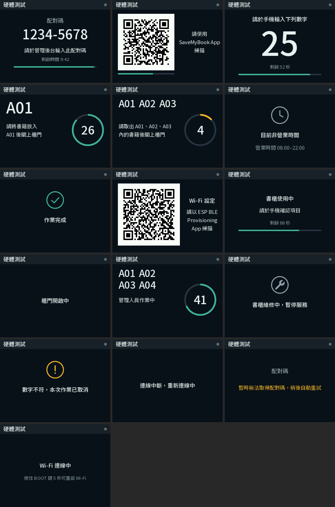

# 智慧書櫃韌體（ESP32-S3）

一片 ESP32-S3 控制四扇櫃門的電磁鎖與 2.8 吋橫向螢幕，透過 HTTPS 與後端同步。協定見 `savemybook_api/docs/device.yaml`。

裝置邏輯從模擬書櫃 `savemybook_api/views/kiosk/device-core.js` 移植，兩邊行為一致。目前不含門磁。



## 硬體

| 元件 | 規格 | 數量 |
|---|---|---|
| 開發板 | GOOUUU ESP32-S3（與 YD-ESP32-S3、ESP32-S3-DevKitC-1 同腳位，Flash 4 MB 以上） | 1 |
| 螢幕 | 2.8 吋 SPI TFT 240×320，ILI9341；附觸控與 SD 卡座，兩者都不接 | 1 |
| 電磁鎖 | 12V 0.6A，通電開鎖、斷電上鎖 | 4 |
| 四路繼電器模組 | 5V 線圈、光耦隔離，低電平觸發 | 1 |
| 12V 電源供應器 | 2A 以上 | 1 |
| 降壓模組 | 12V 轉 5V、2A 以上（LM2596、MP1584 等） | 1 |
| 整流二極體 | 1N4007 | 4 |
| 保險絲與座 | 2A 慢熔 | 1 |
| 電解電容 | 1000µF 25V（12V 端）、470µF 10V（5V 端） | 各 1 |

## 接線

| 元件 | 模組腳位 | 接到 | 說明 |
|---|---|---|---|
| 降壓模組 | IN＋／IN− | 12V＋（保險絲後）／12V− | 先用電錶把輸出調到 5.0V 再接開發板 |
| | OUT＋／OUT− | 開發板 5V／GND | |
| 四路繼電器 | VCC、JD-VCC | 5V | JD-VCC 跳帽保留 |
| | GND | GND | |
| | IN1–IN4 | GPIO4、5、6、7 | 對應櫃門 A01–A04 |
| | COM1–COM4 | 12V＋ | |
| | NO1–NO4 | 電磁鎖 1–4 正極 | NC 不接 |
| 電磁鎖 | 負極 | 12V− | 每顆並聯 1N4007，有白線的一端（陰極）接正極 |
| TFT | VCC／GND | 5V／GND | 模組上有 3.3V 穩壓 |
| | CS／DC／RESET | GPIO10／9／8 | |
| | SDI（MOSI）／SCK | GPIO11／12 | |
| | LED | 3V3 | 背光常亮 |
| | SDO、觸控 T_*、SD 卡 | 不接 | 書櫃螢幕只顯示、不提供操作 |

- 所有 GND 接在一起：12V 負極、降壓模組、開發板、繼電器、螢幕。
- 用到的腳位都在有 5V、3V3 的那一排排針上。
- 避開的腳位：
  - GPIO0、3、45、46（開機設定）
  - GPIO19、20（USB）
  - GPIO26–37（Flash 與 PSRAM）
  - GPIO43、44（序列埠）
- 開發板的 5V 腳預設只能輸入，不要短接板上的 IN-OUT 焊點：短接後降壓模組的 5V 會倒灌進電腦的 USB。

### 安全設計

- **一次只讓一顆鎖通電**：韌體逐扇開鎖，前一扇斷電 300 毫秒後才對下一扇通電，12V 只需扛一顆鎖的 0.6A。
- **用 NO 接點**：停電或繼電器故障時，門維持上鎖。
- **開機不誤開**：GPIO4–7 在重開機期間是高阻抗，低電平觸發的繼電器不會吸合。韌體開機第一件事是先把腳位寫成斷電，再切成輸出。看門狗重置時也一樣。
- **通電時間上限**：每次通電限制在 100–3000 毫秒（協定預設 800 毫秒），避免線圈過熱。
- **反向二極體與電容**：吸收鎖斷電時的反向電壓，鎖通電的瞬間也不會讓 ESP32 掉電重開。

## 開發環境

使用 PlatformIO 加 ESP-IDF 6.1。
- 可以裝 VS Code 的 PlatformIO 擴充套件，或用命令列 `pio`。
- 第一次編譯會自動下載 ESP-IDF 與編譯器，約 6.6 GB，放在 `~/.platformio`。
- 燒錄與看紀錄用板子上標 COM 的那個 USB-C（CH343 序列埠）。

```bash
pio run -e esp32s3
```

| 指令 | 用途 |
|---|---|
| `pio run -e hwtest -t upload` | 燒錄硬體測試版 |
| `pio run -e esp32s3 -t upload` | 燒錄正式版 |
| `pio device monitor` | 看序列埠紀錄 |
| `pio run -e esp32s3 -t menuconfig` | 修改設定（在「SaveMyBook cabinet」選單） |

設定選項：

| 選項 | 預設 | 說明 |
|---|---|---|
| Device API base URL | `https://api.savemybook.today/api/device/v1` | 後端位址 |
| Relay module is low-level triggered | 開 | 繼電器若為高電平觸發，關閉此項 |
| Screen rotation | 1 | 橫向為 1 或 3，依螢幕排針朝哪一側裝設；畫面上下顛倒時改另一個 |
| Panel controller is ILI9341 | 開 | 螢幕若為 ST7789，關閉此項（顏色反相或偏色時也試試看） |

## 第一次上機

1. **硬體測試**（不連網路）：燒錄 `hwtest`。
   - 開機後 5 秒內繼電器都不能吸合。
   - 接著 IN1 到 IN4 逐顆通電 0.8 秒。
   - 之後螢幕輪播各畫面，確認方向、顏色與中文字。
   - 繼電器若在開機時就吸合，或燈微亮，表示模組不適合直接用 3.3V 驅動：有 H/L 跳帽就切到 H，並關閉「Relay module is low-level triggered」。
2. **接上電磁鎖再測一次**：量 12V 在通電時的壓降，確認開發板不會重開。
3. **燒錄正式版並設定 Wi-Fi**：
   - 螢幕會顯示 Wi-Fi 設定用的 QR Code。
   - 用手機安裝 Espressif 官方的「ESP BLE Provisioning」App，掃描後選擇網路並輸入密碼。
   - 設定密碼每次開機隨機產生，只出現在螢幕上，必須在書櫃前才能設定。
   - 要換網路時，按住板上的 BOOT 鍵 5 秒，會清除 Wi-Fi 設定並重新開機，裝置憑證保留。
4. **配對**：
   - 連上網路後，螢幕顯示 8 位數配對碼。
   - 管理員在後台「書櫃裝置」輸入配對碼即可，書櫃上不需操作。
   - 配對成功後螢幕改顯示書櫃 QR Code。

## 在電腦上檢查

兩個工具都直接使用 `src/` 的程式碼，需先執行過一次 `pio run`，讓 `managed_components` 下載 cJSON 與 qrcode 元件。

```bash
bash tools/preview/run.sh
```

- **`tools/preview/run.sh`**：輸出各畫面的實際像素到 `tools/preview/out/sheet.png`，需要 Python 的 Pillow。
- **`tools/devtest/run.sh`**：書櫃邏輯測試。`device.cpp` 原封不動，接上依協定寫的模擬伺服器，以真實時間執行。涵蓋的情境：
  - 配對
  - 逐扇開鎖與 300 毫秒間隔
  - 重複指令不重複執行
  - 手機完成或取消
  - 倒數逾時
  - 往返超過 3 秒不開鎖
  - 憑證撤銷後重新配對
  - 開門中斷電重開
  - 斷線與恢復

```bash
bash tools/devtest/run.sh
```

修改 `src/messages.h` 的字串後，要執行 `python3 tools/make_fonts.py` 重新產生 `src/fonts.c`。字型只收錄用到的字，取自 App 的 Noto Sans TC。

## 程式結構

| 檔案 | 內容 |
|---|---|
| `src/main.cpp` | 開機順序、畫面工作、BOOT 鍵、硬體測試 |
| `src/device.cpp` | 書櫃邏輯：配對、開機代碼、輪詢、事件佇列、開鎖、倒數與結束作業 |
| `src/http.cpp` | HTTPS 長連線，以 ESP-IDF 內建憑證套件驗證伺服器 |
| `src/wifi.cpp` | Wi-Fi 與藍牙設定（Security 2） |
| `src/store.cpp` | NVS：憑證放 `nvs` 分區，事件佇列放獨立的 `evq` 分區分散磨耗 |
| `src/relay.cpp` | 繼電器 |
| `src/display.cpp`、`src/canvas.cpp`、`src/ui.cpp` | 螢幕驅動、繪圖與各畫面版面 |
| `src/messages.h` | 螢幕字串表（與模擬書櫃相同） |

## 尚未啟用

協定要求的 **Flash 加密** 與 **NVS 加密** 還沒有開。開啟後會燒錄 ESP32-S3 的 eFuse，無法復原，也會限制之後重新燒錄的方式。實機測試穩定、準備上線時再啟用。
